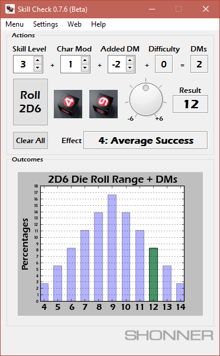

**Skill Check 0.7.6 (Beta) for Python 2.5**
===========================================

This Windows XP/7/10 program performs die rolls for Mongoose Traveller 1st Edition.

The diceroll.pyd module was compiled in C99 using MinGW 4.3.3.

Source is provided for just the Python 2.5.4 portion of the app.

-Shawn